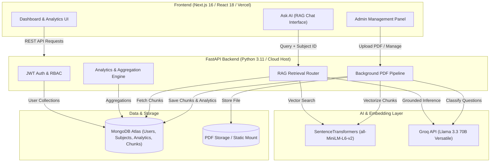

<div align="center">

# 🎓 ExamSense AI

### **Intelligent Academic Analytics & Retrieval-Grounded Exam Preparation Platform**

An end-to-end full-stack platform that transforms past exam papers and lecture materials into actionable academic intelligence, topic mastery insights, difficulty trends, and citation-backed AI tutoring.

[](https://nextjs.org/)
[](https://react.js.org/)
[](https://fastapi.tiangolo.com/)
[](https://www.python.org/)
[](https://groq.com/)
[](https://www.mongodb.com/)
[](https://tailwindcss.com/)
[](LICENSE)

[Features](#-key-features) • [Architecture](#-system-architecture) • [Tech Stack](#-tech-stack) • [Quickstart](#-quickstart-guide) • [Deployment](#-deployment-guide) • [API Docs](#-api-endpoints)

</div>

---

## 📖 Overview

**ExamSense AI** bridges the gap between raw study materials and targeted exam readiness. By combining high-speed PDF text parsing, semantic chunking with local embeddings (`sentence-transformers`), automated question classification via **Groq AI (Llama 3.3 70B)**, and a strict citation-backed Retrieval-Augmented Generation (RAG) assistant, students and educators gain unprecedented insight into syllabus weightage and recurring exam patterns.

---

## ✨ Key Features

- 🔐 **Role-Based Authentication (RBAC)**: Secure JWT authentication with customized experiences for `student` (filtered by academic year) and `admin` (management & uploads).
- 📚 **Subject & Study Material Hub**: Manage subjects across academic years; upload past question papers, syllabus files, and lecture notes.
- ⚡ **Asynchronous Extraction Pipeline**: Background PDF ingestion pipeline (`queued` → `processing` → `completed`/`failed`) extracting text, chunking, and computing vector embeddings.
- 📊 **Deep Question Analytics & Predictions**:
  - **Difficulty Trends**: Historical difficulty progression across exam years.
  - **Topic & Unit Distribution**: Weightage breakdown by topic and syllabus unit.
  - **Repeated Questions Radar**: Smart detection and aggregation of frequently asked questions across multiple years.
- 🤖 **Citation-Grounded Ask-AI (RAG)**:
  - Powered by **Groq API** (`llama-3.3-70b-versatile`) for ultra-low latency responses.
  - Hybrid retrieval combining dense vector similarity (`all-MiniLM-L6-v2`) and lexical overlap.
  - Strict evidence citation linking answers back to original uploaded source materials (`[Source 1]`, `[Source 2]`).
- 🎨 **Modern Dark-Mode Dashboard**: Fast, responsive Next.js 16 interface with interactive Recharts visualizations, collapsible sidebar, and glassmorphic aesthetics.

---

## 🏛️ System Architecture



---

## 🛠️ Tech Stack

| Layer | Technologies | Description |
| :--- | :--- | :--- |
| **Frontend** | Next.js 16, React 18, TypeScript, Tailwind CSS | App Router, SSR/CSR, Responsive Dark Theme |
| **State & Data** | TanStack React Query, Zustand, Axios | Client caching, optimistic state, JWT interceptors |
| **Data Viz** | Recharts, Framer Motion, Lucide React | Interactive charts, fluid layout animations, iconography |
| **Backend API** | FastAPI, Uvicorn, Python 3.10+ | High-performance async REST API with background workers |
| **Database** | MongoDB (PyMongo) | Document store with compound indexes for analytics & chat |
| **AI / LLM** | Groq API (`llama-3.3-70b-versatile`) | High-speed LLM inference & automated question extraction |
| **Embeddings** | SentenceTransformers (`all-MiniLM-L6-v2`) | Local 384-dimensional dense semantic vector representations |
| **PDF Processing** | PyPDF, Regex Parsers | Extract text blocks, exam question numbers, and clean noise |

---

## 📁 Project Structure

```text
examsense-ai/
├── backend/                        # FastAPI Backend Application
│   ├── app/
│   │   ├── ai/                     # AI, Groq LLM, Embeddings, Question Extraction
│   │   │   ├── embeddings.py       # SentenceTransformers embedding generation
│   │   │   ├── llm.py              # Groq API client with fallback models & RAG prompt
│   │   │   ├── pdf_utils.py        # PDF text extraction
│   │   │   ├── question_extractor.py # Question block parser & AI classifier
│   │   │   ├── scoring.py          # Similarity & relevance scoring
│   │   │   ├── similarity.py       # Vector similarity computation
│   │   │   └── text_processing.py  # Text chunking algorithms
│   │   ├── db/
│   │   │   └── database.py         # MongoDB connection & index initializers
│   │   ├── routers/
│   │   │   ├── analytics.py        # Trend, topic, unit, and difficulty endpoints
│   │   │   ├── ask.py              # RAG chat completions & session management
│   │   │   ├── auth.py             # User registration, login, profile, password change
│   │   │   └── subjects.py         # Subject CRUD & PDF background upload pipeline
│   │   ├── auth.py                 # JWT token utilities & password hashing (bcrypt)
│   │   ├── config.py               # Environment configuration loader
│   │   └── schemas.py              # Pydantic validation schemas
│   ├── Dockerfile                  # Container build config for cloud deployment
│   ├── Procfile                    # Process file for Render / Railway / PaaS
│   ├── main.py                     # FastAPI application entrypoint & CORS setup
│   ├── requirements.txt            # Python dependencies
│   ├── test_groq.py                # Diagnostic script to test Groq API key
│   └── reprocess_pdfs.py           # CLI utility to re-run extraction on existing PDFs
│
├── frontend/                       # Next.js 16 Web Application
│   ├── src/
│   │   ├── app/                    # App Router pages (Dashboard, Subjects, Ask AI, Analytics)
│   │   ├── components/             # Reusable UI, Layout, Chart & Chat components
│   │   ├── lib/                    # Axios client, API wrappers, auth store helpers
│   │   ├── store/                  # Zustand stores (Auth & Subject state)
│   │   ├── styles/                 # Tailwind CSS & global design tokens
│   │   └── types/                  # TypeScript interface definitions
│   ├── package.json                # Frontend dependencies and scripts
│   ├── tailwind.config.ts          # Tailwind styling configuration
│   └── tsconfig.json               # TypeScript compiler configuration
│
├── .gitignore                      # Git exclusion rules
└── README.md                       # Documentation
```

---

## ⚡ Quickstart Guide

### Prerequisites

- **Node.js**: v18.0.0 or higher
- **Python**: v3.10 or higher
- **MongoDB**: Local MongoDB instance (`mongodb://localhost:27017`) or free [MongoDB Atlas](https://www.mongodb.com/cloud/atlas) cluster
- **Groq API Key**: Free key from [console.groq.com/keys](https://console.groq.com/keys)

---

### 1. Backend Setup

```bash
# Navigate to backend directory
cd backend

# Create and activate a Python virtual environment
# On Windows:
python -m venv .venv
.venv\Scripts\activate
# On macOS/Linux:
python3 -m venv .venv
source .venv/bin/activate

# Install dependencies
pip install -r requirements.txt

# Configure environment variables
# On Windows:
copy .env.example .env
# On macOS/Linux:
cp .env.example .env
```

Open `backend/.env` and enter your credentials:

```env
MONGODB_URI=mongodb://localhost:27017
MONGODB_DB_NAME=examsense_db
SECRET_KEY=generate-a-strong-random-secret-key
CORS_ORIGINS=http://localhost:3000,http://127.0.0.1:3000
GROQ_API_KEY=your_groq_api_key_here
GROQ_MODEL=llama-3.3-70b-versatile
```

Test your Groq API connection:
```bash
python test_groq.py
```

Start the FastAPI server:
```bash
uvicorn main:app --reload --host 127.0.0.1 --port 8000
```

- API Base URL: `http://127.0.0.1:8000`
- Interactive Swagger Docs: `http://127.0.0.1:8000/docs`

---

### 2. Frontend Setup

Open a new terminal window:

```bash
# Navigate to frontend directory
cd frontend

# Install Node dependencies
npm install

# Configure environment variables
# On Windows:
copy .env.example .env.local
# On macOS/Linux:
cp .env.example .env.local
```

Ensure `frontend/.env.local` contains:
```env
NEXT_PUBLIC_API_URL=http://localhost:8000
```

Start the Next.js development server:
```bash
npm run dev
```

Open [http://localhost:3000](http://localhost:3000) in your browser.

---

## 🌐 Deployment Guide

### Architecture Overview
- **Frontend**: Deployed to **Vercel** (`frontend` directory).
- **Backend**: Deployed to **Render**, **Railway**, **Fly.io**, or **Docker** host (supports PyTorch embeddings + persistent storage).
- **Database**: Cloud-hosted on **MongoDB Atlas**.
- **AI**: Managed via **Groq API**.

---

### Step 1: Deploy Database (MongoDB Atlas)
1. Create a free **M0 Cluster** at [MongoDB Atlas](https://www.mongodb.com/cloud/atlas).
2. Create a database user under **Database Access**.
3. Under **Network Access**, allow access from anywhere (`0.0.0.0/0`).
4. Copy your connection URI (`mongodb+srv://<username>:<password>@cluster0.mongodb.net/?retryWrites=true&w=majority`).

---

### Step 2: Deploy Backend (e.g. Render / Railway)

#### On [Render](https://render.com):
1. Create a **New Web Service** from your GitHub repository.
2. Configure settings:
   - **Root Directory**: `backend`
   - **Environment**: `Python 3`
   - **Build Command**: `pip install -r requirements.txt`
   - **Start Command**: `uvicorn main:app --host 0.0.0.0 --port $PORT`
3. Add Environment Variables:
   - `MONGODB_URI`: `<Your MongoDB Atlas connection URI>`
   - `MONGODB_DB_NAME`: `examsense_db`
   - `SECRET_KEY`: `<Your production secret key>`
   - `GROQ_API_KEY`: `<Your Groq API key>`
   - `GROQ_MODEL`: `llama-3.3-70b-versatile`
   - `CORS_ORIGINS`: `https://*.vercel.app,http://localhost:3000`
4. Deploy and copy your backend URL (e.g., `https://examsense-backend.onrender.com`).

---

### Step 3: Deploy Frontend (Vercel)
1. Import your GitHub repository to [Vercel](https://vercel.com).
2. Set **Root Directory** to `frontend`.
3. Framework Preset: `Next.js`.
4. Add Environment Variable:
   - `NEXT_PUBLIC_API_URL`: `https://examsense-backend.onrender.com` (your backend URL without trailing slash).
5. Click **Deploy**.

---

## 📡 API Endpoints

### Authentication (`/auth`)
| Method | Route | Description | Auth Required |
| :--- | :--- | :--- | :---: |
| `POST` | `/auth/register` | Register new student or admin | No |
| `POST` | `/auth/login` | Login and receive JWT access token | No |
| `GET` | `/auth/me` | Get currently logged-in user profile | Yes |
| `PATCH` | `/auth/me` | Update profile information | Yes |
| `POST` | `/auth/change-password`| Update user password | Yes |

### Subjects & Materials (`/subjects`)
| Method | Route | Description | Role |
| :--- | :--- | :--- | :---: |
| `GET` | `/subjects` | Get subjects (filtered by student year if applicable) | Student / Admin |
| `POST` | `/subjects` | Create a new subject | Admin |
| `GET` | `/subjects/{id}` | Get subject details and associated materials | Student / Admin |
| `DELETE`| `/subjects/{id}` | Delete subject and all related chunks/analytics | Admin |
| `POST` | `/subjects/{id}/materials` | Upload PDF material (triggers background processing) | Admin |
| `DELETE`| `/subjects/{id}/materials/{m_id}` | Delete material and associated vector chunks | Admin |

### Analytics (`/analytics`)
| Method | Route | Description |
| :--- | :--- | :--- |
| `GET` | `/analytics/summary` | Get aggregated stats (questions, materials, top topics) |
| `GET` | `/analytics/difficulty-trend?subject_id=` | Difficulty distribution mapped over historical exam years |
| `GET` | `/analytics/topic-distribution?subject_id=` | Topic frequency and percentage breakdown |
| `GET` | `/analytics/unit-distribution?subject_id=` | Syllabus unit frequency analysis |
| `GET` | `/analytics/difficulty-distribution?subject_id=`| Easy / Medium / Hard ratio breakdown |
| `GET` | `/analytics/repeated-questions?subject_id=` | Questions appearing across multiple exam years |

### Ask AI / RAG (`/ask`)
| Method | Route | Description |
| :--- | :--- | :--- |
| `POST` | `/ask` | Submit question; retrieves context & returns citation-backed answer |
| `GET` | `/ask/sessions` | Fetch user chat session history |
| `GET` | `/ask/sessions/{id}` | Fetch specific session and message thread |
| `DELETE`| `/ask/sessions/{id}` | Delete chat session |

---

## 🔒 Security & Best Practices

- **Never commit `.env` or `.env.local` files**: All secrets and API keys are strictly excluded via `.gitignore`.
- **JWT Protection**: Stateless bearer tokens with HS256 encryption.
- **Strict Role Enforcement**: Administrative actions (uploading past papers, creating subjects, deleting records) are guarded on the backend.
- **CORS Allowlist**: Restricted to trusted origins and dynamically configurable for production domains.

---

## 📄 License

This project is open source and available under the [MIT License](LICENSE).
